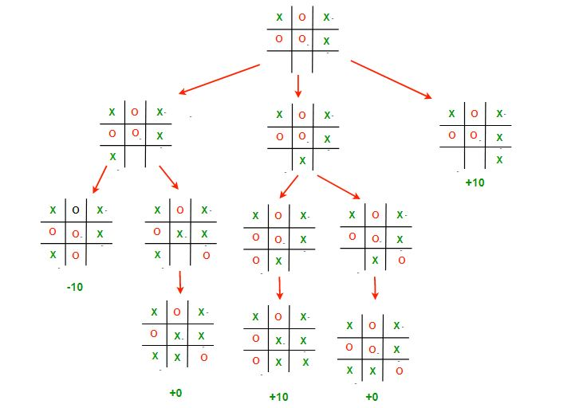

# TicTacToe-game

### What is Tic Tac Toe game?

Tic Tac Toe is a two player game where each player is assigned a marking symbol X or O.
In a 3×3 grid, each player have to place their symbol.
The player who succeeds in placing three of their marks in a diagonal, horizontal, or vertical row is the winner.
Rules Of Playing Tic Tac Toe Game

### The Tic Tac Toe game takes place in following steps.

* In first step, we have to consist a 3×3 grid.
* It is a two player game so each player is assigned with a symbol X or O.
* In first turn, the first player(whosesoever turn) will place his/her marking symbol in any of the 9 cells.
* In second turn, the second player will place his/her marking symbol in any of available 8 cells.
* This process will go on until any of the players will make three successive square grids of the same sign either vertically, horizontally or diagonally.
* If the player having X marking symbol will achieve the above result then he/she will win or if the player having O marking symbol will achieve the above result then he/she will win.
* If the grid contains no free cell left and none of the above conditions arrived, the Game will end with a tie.

### 2 options for the game:
1) 2 players
2) player vs computer

for "player vs computer" -  the MinMax algorithm is implemented:

### MinMax algorithm

